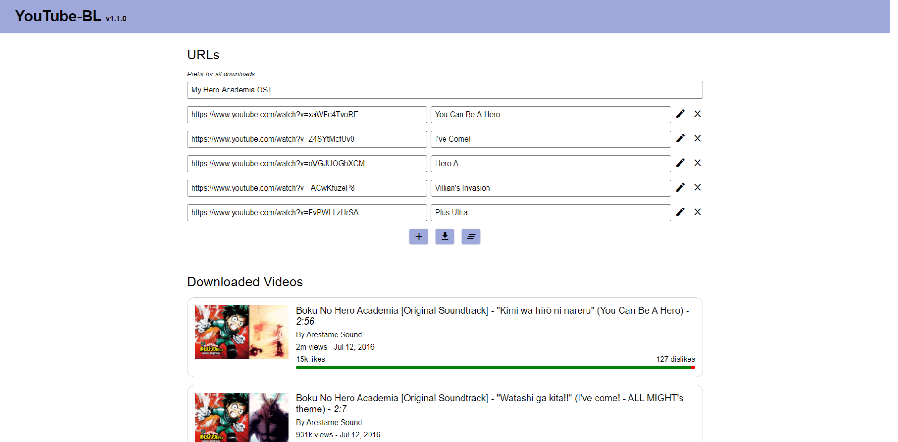

# YTBL


## About this Project

Ben's YouTube Downloader web app for batch downloading



I wanted a reliable way to download music that wasn't on Spotify (e.g. anime OSTs).

### Built with

- Nuxt.js
- Express.js

## Getting Started

### Prerequisites

- Node

### Installation

> `youtube-dl` is a CLI YouTube downloader. `FFmpeg` is a fast CLI video and audio converter. These two CLI tools are used by this app.

1. Install `youtube-dl`.

```
`pip install --upgrade youtube-dl`
```

2. Install `FFmpeg`.

   1. Download the release essentials build zip from [gyan.dev](https://www.gyan.dev/ffmpeg/builds/).
   2. Extract the zip and place the folder somewhere you want to leave it.
   3. Add the path to the bin folder, to your user path environment variable.

3. Install dependencies.

```
npm i
```

4. Double click `ytbl.bat` or run:

```
npm run express
```

Go to `http://localhost`

5. (Optional) create a shortcut to `ytbl.bat` on your desktop for quick access.

## Deployment

This project is not currently deployed anywhere. The only way to use it is to run it locally.

This could be updated by hosting it on AWS Lightsail (although this might not be a good idea for legal reasons) or by re-packaging this app as an Electron desktop app for my own personal use.

## Usage

To add

## Roadmap

- [ ] Rename prefix to suffix
- [ ] Move suffix into options section
- [ ] Add subfolder to options section
- [ ] Number URLs
- [ ] Trim inputs
- [ ] Save URLs to local storage in case leave page
- [ ] Anime reskin & replace header with anime banner
- [ ] Get progress from youtube-dl and display progress bar
- [ ] Refactor
- [ ] More backend URL validation
- [ ] Links section to popular anime OST YT searches
- [ ] Support for playlists
- [ ] Change icon

## Release History

- v0.2.0
  - Batch filename prefixing
  - File renaming
  - Download timer
- v0.1.1
  - Url deleting
  - Transitions
- v0.1.0
  - Initial design
